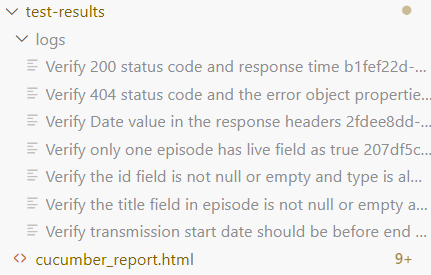

# BBC Senior Software Engineer in Test Take Home Test

## Team: IBL (iPlayer Business Layer)

### Overview

This project contains automated test cases for the provided public API using TypeScript, Playwright, and Cucumber. The scenarios cover the functional aspects of the API based on the requirements provided.

### Prerequisites

Ensure you have the following installed on your machine:
- **Node.js** (version 18.12.1 or higher)- I have used 21.1.0
- **npm** (Node Package Manager)
- **Git** (for cloning the repository)

### Installation Instructions

1. **Clone the Repository by using git clone https://github.com/Urvashijuneja/Ibl_automation.git**
   --bash
   git clone https://github.com/Urvashijuneja/Ibl_automation.git

2. **Navigate to the Project Directory using cd Ibl_automation**
   cd Ibl_automation

3. **Switch to the Correct Branch Api_Automation using git checkout Api_Automation**
git checkout Api_Automation

4. **Open cloned repository in visual studio code ide**

5. **Click on "open in integrated terminal option" by right clicking "apitests" folder**

6. **Install Dependencies by using npm install- this will install all dependencies specified in package.json**
--Enter npm install 
 eg:-C:\Users\MDUser\NewAutomation\IBL-API-AUTOMATION\Ibl_automation\apitests> npm install

7. **Run all tests**
-C:\Users\MDUser\NewAutomation\IBL-API-AUTOMATION\Ibl_automation\apitests> npm run apitest
-package.json contains script called apitest which runs all tests with tag @ibltest, can change tags if needed and rerun

8. **View test results folder for report and logs**

### Project Structure**

 - **features/**: Contains the Gherkin feature files, each describing a specific set of scenarios from take home test.
        Example: Scenario 1, Scenario 6, Scenario 7 are grouped in apiResponseVerification.feature
                 Scenario 2, Scenario 3, Scenario 4 are grouped in episodeDataValidation.feature
                 Scenario 5 is defined in dateValidation.feature

 - **step-definitions/**: Contains the step definitions that implement the steps in the Gherkin files.
        Example: All assertions are implemented api-assertions.ts.
               : api-response-verification-steps.ts,date-validation-steps.ts and episode-date-validation-steps.ts contains steps  of  respective feature files
               common-response.ts gets and sets response so can be accessed in between cucumber steps of scenario.

 - **package.json/**: The configuration file for npm, containing scripts and dependencies.

 - **world.ts/**: All cucumber hooks are defined in this file.

### Logger Implementation (`logger.ts`)

The `logger.ts` file contains a custom logging utility that provides consistent and formatted logging throughout the framework. It helps in tracking the execution flow, debugging, and capturing important information or errors during test runs.

- **Usage**: The logger is used in various parts of the code to log messages, warnings, and errors.
- **Customization**: You can customize the logging levels (e.g., info, debug, error) as needed.

### Environment Configuration (`.env`)

The `.env` file is used to manage environment-specific configurations, such as API base URLs, credentials, and other sensitive information. This allows the tests to run against different environments (e.g., development, staging, production) without changing the code and easy to integrate in pipeline.

- **Usage**: Environment variables defined in the `.env` file are accessed using `process.env.VARIABLE_NAME`.
- **Examples**: 
  - `API_BASE_URL=https://testapi.io/api`
  - `MESSAGE=In test Environment`

### Dependencies:

- This project uses Playwright and Cucumber for testing.
- Axios is used for making HTTP requests within the step definitions.
- TypeScript is used for strict typing and better maintainability.